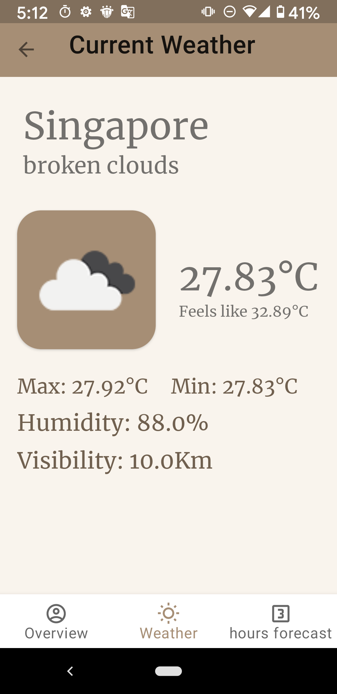

# Demo Weather Application

This is a personal project that demostrates my current knowledge of Kotlin and Android APP development.

## Weather Application

The first tab of the app includes my basic information while I tried to make it interactive with data-binding technique.
The second tab displays weather condition based on user's current location using [Openweathermap](https://openweathermap.org/api/).
The third tab displays a list of 3 hour future forecast using RecyclerView.
While clicking on the RecyclerView, it will open up a detail page and carry selected data with it with Safe Args.

This app demonstrates the following techniques:

* Two-way databinding
* RecyclerView
* Room database
* Coroutines
* LiveData 
* Navigation with the SafeArgs plugin
* Retrofit to make api calls to an HTTP web service
* Moshi which handles the deserialization of the returned JSON to Kotlin data objects
* Glide to load and cache images by URL
  

## Screenshots

 

